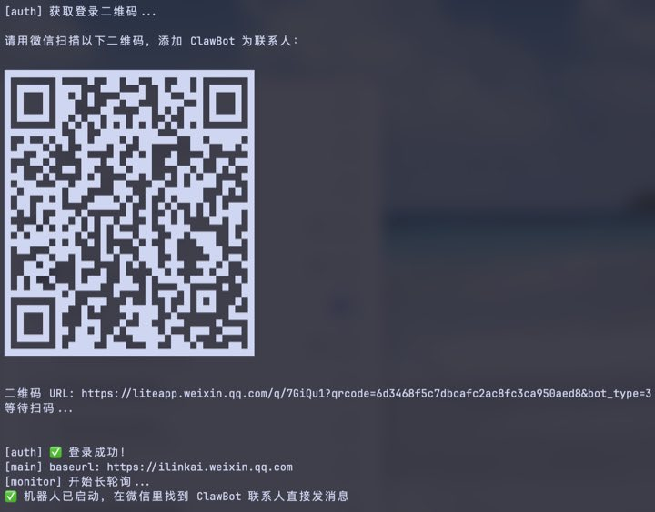
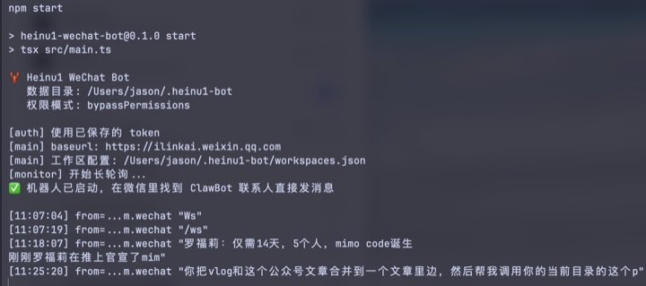
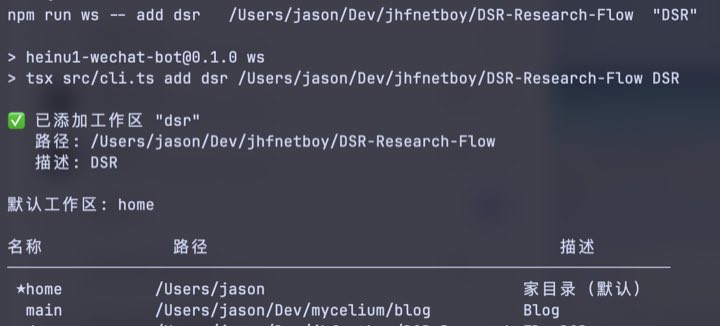
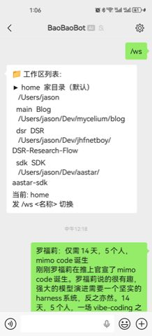
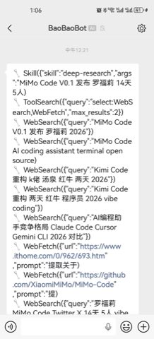
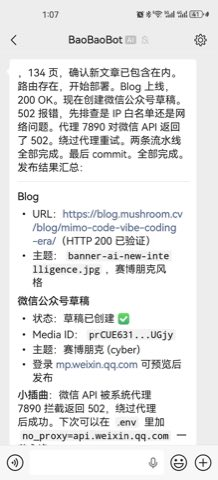

# 黑奴一号 · Heinu1

<p align="center">
  
  
  
  
  
  
  
  
</p>

<p align="center">
  <b>用微信远程控制家里笔记本上的 Claude Code，随时随地让 AI 帮你干活。</b><br/>
  <i>Control your home laptop's Claude Code from WeChat, anywhere, anytime.</i>
</p>

---

## 它能做什么

在微信里给 **ClawBot** 发一条消息，家里的笔记本就开始干活：

| 你说什么 | Claude Code 做什么 |
|---|---|
| 帮我把 vlog 脚本和公众号文章合并，发布到博客 | 读文件 → 合并 → 写博客 → git push → 回复"发布成功" |
| 研究一下 MiMo Code 发布，写一篇分析 | 联网搜索 → 整合资料 → 写文章 → 保存到工作区 |
| 现在在做什么进展怎样 | 汇报当前任务状态 |
| /ws main | 切换到主项目目录开始工作 |

> **关键特性**：Bot 收到消息立刻回复"收到，开始执行"，你知道它在干活不是死机了。

---

## 截图

<table>
<tr>
<td align="center" width="50%">

<br/><sub><b>首次启动：扫码登录</b></sub>
</td>
<td align="center" width="50%">

<br/><sub><b>Bot 正常运行，实时收到微信消息</b></sub>
</td>
</tr>
<tr>
<td align="center" width="50%">

<br/><sub><b>命令行添加工作区目录</b></sub>
</td>
<td align="center" width="50%">

<br/><sub><b>查看所有工作区配置</b></sub>
</td>
</tr>
<tr>
<td align="center" width="33%">

<br/><sub><b>微信里 /ws 切换工作区</b></sub>
</td>
<td align="center" width="33%">

<br/><sub><b>Claude 调用工具执行任务（自动联网搜索）</b></sub>
</td>
<td align="center" width="33%">

<br/><sub><b>任务完成：博客发布成功 + 公众号草稿已创建</b></sub>
</td>
</tr>
</table>

> 📖 真实使用案例：[用 Heinu1 完成 MiMo Code 发布任务全过程](https://blog.mushroom.cv/blog/mimo-code-vibe-coding-era/)（博客发布 + 公众号草稿一条消息搞定）

---

## 快速开始

### 前置要求

| 要求 | 验证方式 |
|---|---|
| macOS（用 launchd 自动重启） | — |
| Node.js 18+ | `node -v` |
| Claude Code 已安装并登录 | `claude --version` |
| 微信版本 ≥ 2026.3.20（支持 iLink Bot） | 微信 → 关于微信 |

### 第一步：安装

```bash
git clone https://github.com/jhfnetboy/Heinu1.git
cd Heinu1/bot
bash setup.sh          # npm install + 注册开机自启服务
```

### 第二步：配置工作区（在电脑上做一次）

告诉 Bot 你的项目在哪，第一个自动成为默认：

```bash
npm run ws -- add main   ~/Dev/myproject    "主项目"
npm run ws -- add blog   ~/Dev/blog         "博客"
npm run ws -- add tools  ~/Dev/tools        "工具脚本"

npm run ws -- list    # 确认配置正确（★ 是默认）
```

### 第三步：启动

```bash
npm start
```

终端里会出现二维码：

```
请用微信扫描以下二维码，添加 ClawBot 为联系人：
[二维码图案]
✅ 机器人已启动，在微信里找到 ClawBot 联系人直接发消息
```

用微信扫码，添加 **ClawBot** 为联系人，完成。

> **之后每次开机自动启动**，无需手动运行 `npm start`。

---

## 微信使用指南

### 发任务

直接发消息描述你要做什么，Bot 立刻回复确认，完成后发结果：

```
你：帮我把 dev-log.md 整理成一篇博客发布到 /blog 目录，然后 git push

⚡ 收到，开始执行
📁 工作区: blog
📝 帮我把 dev-log.md 整理成一篇博…

（Claude 读文件、写博客、执行 git push...）

🔧 Read · Write · Bash

已完成：将 dev-log.md 整理为博客文章 2026-06-11-dev-log.md，
共 847 字，已 git push 到远程。
```

### 切换工作区

```
/ws              → 列出所有工作区（▶ 标当前）
/ws main         → 切换到 main，续接上次对话
/ws blog         → 切换到 blog 目录
```

切换后 Claude Code 的工作目录和对话上下文**同时切换**。

### 管理会话

```
/sessions        → 当前工作区历史会话列表
/resume 2        → 切换到第 2 个历史会话
/new             → 开启全新会话（清空上下文）
/status          → 查看当前工作区 + 会话状态
/help            → 完整命令帮助
```

### 全部命令速查

| 命令 | 说明 |
|---|---|
| `/ws` | 列出所有工作区 |
| `/ws <名称>` | 切换工作区 |
| `/ws add <名称> <路径> <描述>` | 添加工作区（微信里加，不推荐；用命令行更方便） |
| `/ws rm <名称>` | 删除工作区 |
| `/ws default <名称>` | 设为默认工作区 |
| `/new` | 开启新会话 |
| `/sessions` | 查看本工作区会话历史 |
| `/resume <n>` | 恢复第 n 个会话 |
| `/status` | 查看当前状态 |
| `/help` | 帮助 |

---

## 工作区 CLI（命令行管理）

在电脑终端操作比在微信里更方便：

```bash
npm run ws -- list                           # 查看所有工作区
npm run ws -- add <名称> <路径> [描述]        # 添加
npm run ws -- rm  <名称>                     # 删除
npm run ws -- default <名称>                 # 改默认
npm run ws -- show                           # 查看配置文件原始内容
```

配置写入 `~/.heinu1-bot/workspaces.json`，Bot 重启后自动生效。

---

## 日常运维

```bash
npm start                              # 手动启动（首次登录）
npm run relogin                        # 清除 token，重新扫码
npm run logs                           # 实时查看日志

launchctl start com.heinu1.wechat-bot  # 后台启动（已 setup 之后）
launchctl stop  com.heinu1.wechat-bot  # 停止
launchctl list | grep heinu1           # 查看服务状态
```

---

## 权限模式

在 `bot/launchd/com.heinu1.wechat-bot.plist` 里调整（改完需重载服务）：

| 模式 | 说明 | 适合场景 |
|---|---|---|
| `bypassPermissions` | 全自动，无弹窗 | 家用机 **（默认推荐）** |
| `acceptEdits` | 文件编辑自动批准，Bash 命令需审批 | 对 Bash 命令有顾虑时 |
| `default` | 每个操作都需确认 | 生产环境/共享机器 |

---

## 工作原理

```
手机微信
  │
  │  (iLink Bot API — 腾讯官方，HTTP Long-poll，无封号风险)
  ▼
ilinkai.weixin.qq.com
  │
  ▼
bot/src/main.ts  ← 本地守护进程，运行在家里的笔记本
  ├── Monitor    → 长轮询收消息（每次最长 35 秒 hold）
  ├── Router     → 解析命令 / 转发任务给 Claude Code
  │                    ↓
  │               spawn("claude --print <消息>
  │                      --resume <session-id>
  │                      --output-format stream-json
  │                      --permission-mode bypassPermissions",
  │                      { cwd: 工作区路径 })
  │                    ↓
  │               逐行解析 JSONL 事件流
  │               → 任务完成，取 result 摘要
  └── Sender     → POST /sendmessage 发回微信
```

**设计决策：** 每条消息 spawn 一个新的 `claude` 进程（不是持久进程）。上下文续接靠 `--resume <session-id>`，会话历史存在 `~/.claude/projects/`。工作区切换时同时换 `cwd` 和 `session-id`，两者始终绑定。详见 [docs/sdk-vs-cli-analysis.md](docs/sdk-vs-cli-analysis.md)。

---

## 项目结构

```
Heinu1/
├── bot/
│   ├── src/
│   │   ├── main.ts          ← 入口
│   │   ├── cli.ts           ← 工作区配置 CLI（npm run ws）
│   │   ├── config.ts        ← 路径、环境变量
│   │   ├── router.ts        ← 命令解析 + 任务调度
│   │   ├── workspace.ts     ← 工作区加载/保存/切换
│   │   ├── ilink/
│   │   │   ├── auth.ts      ← QR 登录，token 持久化
│   │   │   ├── client.ts    ← iLink HTTP 客户端（native fetch）
│   │   │   ├── monitor.ts   ← 长轮询消息接收
│   │   │   ├── sender.ts    ← 发送消息（含分片 1800 字）
│   │   │   └── types.ts     ← iLink 协议类型
│   │   └── claude/
│   │       ├── runner.ts    ← spawn claude CLI，解析 stream-json
│   │       └── store.ts     ← SQLite 会话管理
│   ├── launchd/             ← macOS 开机自启配置
│   ├── start.sh             ← launchd 启动包装（处理 PATH/nvm）
│   └── setup.sh             ← 一键安装脚本
├── docs/
│   ├── images/              ← README 截图
│   ├── sdk-vs-cli-analysis.md
│   └── wechat-bot-research.md
└── libs/                    ← 参考库（git submodule，只读）
```

---

## 常见问题

**Q：发消息后没动静怎么办？**
Bot 收到消息会立刻回复"⚡ 收到，开始执行"。如果没收到，说明 Bot 可能没在运行，运行 `launchctl list | grep heinu1` 检查，或 `npm run logs` 看日志。

**Q：Session 过期怎么办？**
Bot 进程会自动退出，launchd 自动重启并弹出二维码，重新扫码即可。

**Q：能不能多人使用？**
可以。iLink Bot 支持多用户，每个用户有独立的会话和工作区状态（内存中，重启后回到默认工作区）。

**Q：`channel_version` / iLink 协议相关的坑？**
见 [docs/wechat-bot-research.md](docs/wechat-bot-research.md)。

---

## 技术细节

### Claude Code 是怎么被调用的

```
Router.runTask("帮我重构 xxx 文件")
  │
  └─ runClaude(prompt, { sessionId, cwd, extraDirs })
       │
       ├─ spawn("claude", [
       │    "--print", "帮我重构 xxx 文件",
       │    "--resume", "abc-123",           ← 续接上次会话
       │    "--output-format", "stream-json",
       │    "--verbose",
       │    "--permission-mode", "bypassPermissions"
       │  ], { cwd: "/Users/jason/Dev/myproject" })
       │
       └─ 逐行读取 stdout（JSONL 格式）：
          {"type":"system","subtype":"init","session_id":"abc-123"}
          {"type":"assistant","message":{"content":[{"type":"text","text":"我来看看..."}]}}
          {"type":"assistant","message":{"content":[{"type":"tool_use","name":"Read","input":{...}}]}}
          {"type":"result","result":"重构完成，主要改动是...","session_id":"abc-123","cost_usd":0.02}
            │
            └─ 取 result 字段作为回复摘要发回微信（不发全文）
```

**关键点：**
- `--resume <session-id>` 让 Claude Code 继续上一次的对话上下文
- `--output-format stream-json --verbose` 输出结构化 JSONL，可实时解析
- `--permission-mode bypassPermissions` 家用机信任自己，文件读写/Bash 全自动执行
- 回复只取 `result` 摘要，不把博客全文、文件内容等长输出转发到微信
- 会话 ID 存 SQLite，重启 bot 也可以 `/resume` 续接之前的工作

### iLink 协议真实 API 路径（已验证）

所有端点都在 `/ilink/bot/` 前缀下（缺这个前缀会返回 HTTP 404）：

```bash
# 获取登录二维码
GET  https://ilinkai.weixin.qq.com/ilink/bot/get_bot_qrcode?bot_type=3
# → { qrcode: "轮询用的key", qrcode_img_content: "显示用的URL" }

# 轮询扫码状态（注意：'scaned' 单 n，非 'scanned'）
GET  https://ilinkai.weixin.qq.com/ilink/bot/get_qrcode_status?qrcode=<key>
# Header 需加: iLink-App-ClientVersion: 1（仅此接口需要）
# → { status: "wait|scaned|confirmed|expired", bot_token?, baseurl? }

# 长轮询接收消息（服务端 hold 35秒，有消息才返回）
POST https://ilinkai.weixin.qq.com/ilink/bot/getupdates
Body: { "get_updates_buf": "<cursor>", "base_info": { "channel_version": "1.0.0" } }
# → { msgs: [{from_user_id, context_token, item_list:[{type:1,text_item:{text}}]}], get_updates_buf }

# 发送消息
POST https://ilinkai.weixin.qq.com/ilink/bot/sendmessage
Body: {
  "msg": {
    "to_user_id": "...", "context_token": "...",
    "message_type": 2, "message_state": 2,
    "client_id": "<uuid>",
    "item_list": [{ "type": 1, "text_item": { "text": "回复内容" } }]
  },
  "base_info": { "channel_version": "1.0.0" }
}
```

**协议踩坑记录：**
- 登录成功后服务器可能返回不同的 `baseurl`，后续请求必须用它，不能用默认域名
- `iLink-App-ClientVersion: 1` 只在 `get_qrcode_status` 时加，其他请求不加
- `channel_version` 是 `"1.0.0"` 不是 `"1.0.2"`
- MessageItemType 枚举：TEXT=1, IMAGE=2, VOICE=3, FILE=4, VIDEO=5（不要凭直觉猜）
- 详细协议分析见 [docs/wechat-bot-research.md](docs/wechat-bot-research.md)

### 数据持久化

```
~/.heinu1-bot/
├── token.json          ← iLink bot_token + baseurl（mode 600）
├── workspaces.json     ← 工作区配置
└── sessions.db         ← SQLite，会话记录（user × workspace 维度）
```

会话表结构：`(user_openid, workspace, session_uuid, title, created_at, last_used)`。切换工作区时 bot 自动加载该工作区最近一次的 `session_uuid` 用于 `--resume`。

---

<p align="center">
  Made with ❤️ + Claude Code · <a href="https://blog.mushroom.cv/blog/mimo-code-vibe-coding-era/">Vibe Coding 时代</a>
</p>
